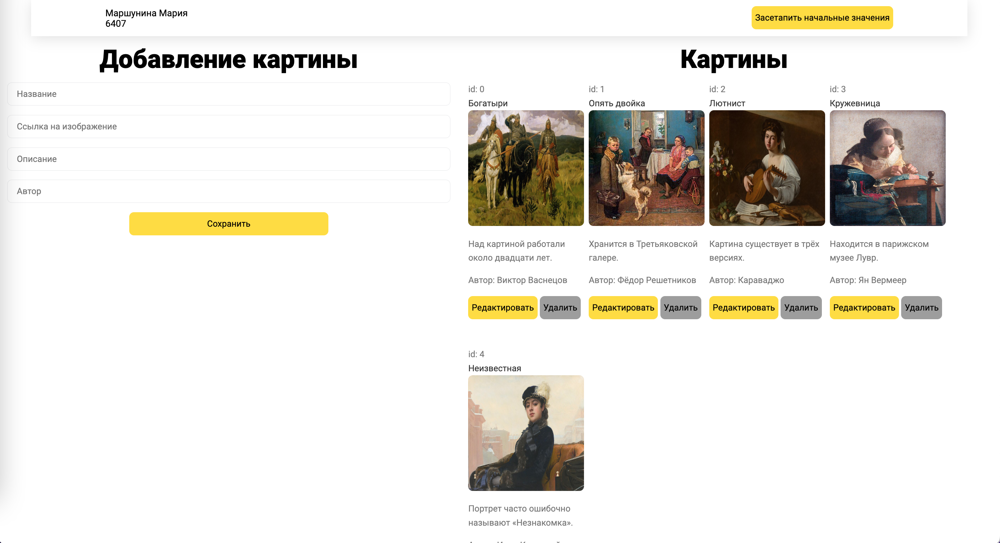

# task4 - dom

## Описание магазин картин

В качестве шаблона использовалось приложение из task1



## Запуск

### Frontend
1. Скомпилировать приложение

```bash
npm run build
```

2. Запустить в debug режиме

```bash
npm run dev
```

3. Перейти по ссылке из консоли

### Backend
0. Установить python>3.8 (если у вас его нет)

1. Установить poetry 
```bash
pip install poetry 
```

2. Установить зависимости
```bash
poetry install
```

3. Запустить приложение
```bash
poetry run start
```